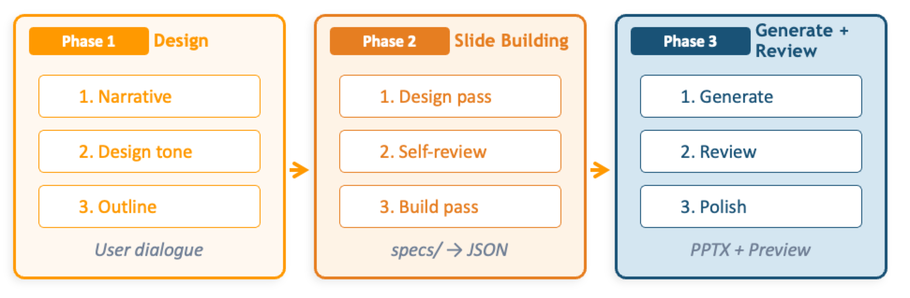

> 📝 [日本語版 README はこちら](README_ja.md)

# Spec-Driven Presentation Maker

[](LICENSE)
[](https://github.com/aws-samples/sample-spec-driven-presentation-maker/actions/workflows/ci.yml)

An open-source toolkit for creating presentations using a spec-driven approach.
Design "what to communicate" first, then let AI build "how to present it."

<!-- TODO: Replace with demo GIF/video after recording -->
<!--  -->

---

## What is Spec-Driven Presentation?

Traditional slide creation follows a "open a blank slide and figure it out as you go" approach.
Without a clear structure, time is spent tweaking visuals while the core message gets diluted.

Spec-driven presentation applies the concept of Spec-Driven Development from software engineering to presentation creation.

| | Traditional | Spec-Driven |
|---|---|---|
| Starting point | Blank slide | Source materials and requirements |
| Design | Think while building | Define logical structure as a spec first |
| Build | Manual layout | AI builds automatically following the template |
| Quality | Ad hoc | Reviewable process based on the spec |

### Workflow



### What you can ask for

Beyond creating a new deck from scratch, the agent is routed to these workflows
automatically — just describe what you want:

| Ask | What happens |
|---|---|
| "Make slides about …" | New presentation (brief → art direction → outline → parallel slide composition → review) |
| "Edit this PPTX" | Imports an existing PPTX into an editable deck |
| "I hand-edited the PPTX, continue from it" | Syncs your PowerPoint edits back into the deck |
| "Create a style like …" | Builds a reusable style guide (colors, typography, decoration) |
| "Translate this deck to English" | Creates a language-variant deck next to the original (source deck untouched) |

---

## Quick Start

How do you want to use SDPM?

### Use it in your browser (full experience)

Install the local Web UI on macOS or Linux with one command:

```bash
curl -fsSL https://raw.githubusercontent.com/aws-samples/sample-spec-driven-presentation-maker/main/scripts/install/dist/install.sh | bash
```

The installer adds the required tools, builds the Web UI, and creates the `sdpm`
launcher and a desktop shortcut. Run `sdpm` at any time to open
[http://localhost:3000](http://localhost:3000).

On Windows (verified in CI only; no manual Windows QA yet), run:

```powershell
irm https://raw.githubusercontent.com/aws-samples/sample-spec-driven-presentation-maker/main/scripts/install/dist/install.ps1 | iex
```

### Use it from the AI agent you already have

Choose your client and complete the action shown. The `uvx` options do not require a
repository checkout. Expect the first launch to take tens of seconds while the package is built.

| Client | One-action setup |
|---|---|
| Claude Desktop | [Download `sdpm.mcpb`](https://github.com/aws-samples/sample-spec-driven-presentation-maker/releases/latest/download/sdpm.mcpb), then double-click it |
| Cursor | [](cursor://anysphere.cursor-deeplink/mcp/install?name=sdpm&config=eyJjb21tYW5kIjoidXZ4IiwiYXJncyI6WyItLWZyb20iLCJnaXQraHR0cHM6Ly9naXRodWIuY29tL2F3cy1zYW1wbGVzL3NhbXBsZS1zcGVjLWRyaXZlbi1wcmVzZW50YXRpb24tbWFrZXIjc3ViZGlyZWN0b3J5PXNlcnZlcnMvbG9jYWwiLCJzZHBtLW1jcCJdfQ==) |
| Visual Studio Code | `code --add-mcp '{"name":"sdpm","command":"uvx","args":["--from","git+https://github.com/aws-samples/sample-spec-driven-presentation-maker#subdirectory=servers/local","sdpm-mcp"]}'` |
| Kiro CLI | `kiro-cli mcp add --name sdpm --command uvx --args '["--from","git+https://github.com/aws-samples/sample-spec-driven-presentation-maker#subdirectory=servers/local","sdpm-mcp"]' --scope global` |
| Claude Code | `/plugin marketplace add aws-samples/sample-spec-driven-presentation-maker` then `/plugin install sdpm@sdpm` |
| Codex | Run `codex plugin marketplace add ./` in the checkout, then install from the ChatGPT desktop app |

For the `uvx` options, install **uv**, **LibreOffice**, and **poppler** in one step
(LibreOffice and poppler provide PNG previews):

```bash
curl -fsSL https://raw.githubusercontent.com/aws-samples/sample-spec-driven-presentation-maker/main/scripts/install/dist/install.sh | bash -s -- --deps-only
```

Then ask your agent: **“Make slides about …”** The first tool it reaches for,
`start_presentation`, returns the role document that drives the work together with the
styles and templates on offer — the MCP server alone is the complete setup; no skills or
agent definitions are required. See [Getting Started](docs/en/getting-started.md) for asset
installation, updates, Kiro IDE Power, manual MCP configuration, and AWS deployment.

**Picking a mode.** Just asking for slides is enough — the agent calls `start_presentation`
and follows it. To choose explicitly, use the server's prompts where your client shows them:
`sdpm-vibe` (build from material, no questions), `sdpm-spec` (shape the deck in dialogue
first), `sdpm-style` (a reusable style guide), `sdpm-translate` (a language variant of a deck) — Claude
Desktop's "+" menu, Claude Code `/mcp__sdpm__sdpm-vibe`, VS Code `/mcp.sdpm.sdpm-vibe`, Kiro CLI
`/sdpm-vibe`. Each prompt only names the role's entry tool; the behavior itself still lives in
`sdpm/references/workflows/`, in one place.

> **Upgrading from an older release?** Directory layout, tool names and skills changed —
> see the [v0.5](docs/en/migration-v0.5.md) and [role workflows](docs/en/migration-role-workflows.md)
> migration notes.

---

## One-Click Deploy — Just an AWS Account to Get Started

| Region | Launch |
|--------|--------|
| Tokyo (ap-northeast-1) | [](https://ap-northeast-1.console.aws.amazon.com/cloudformation/home#/stacks/create/review?stackName=SdpmDeploymentStack&templateURL=https://aws-ml-jp.s3.ap-northeast-1.amazonaws.com/asset-deployments/SdpmDeploymentStack.yaml) |
| N. Virginia (us-east-1) | [](https://us-east-1.console.aws.amazon.com/cloudformation/home#/stacks/create/review?stackName=SdpmDeploymentStack&templateURL=https://aws-ml-jp.s3.ap-northeast-1.amazonaws.com/asset-deployments/SdpmDeploymentStack.yaml) |
| Oregon (us-west-2) | [](https://us-west-2.console.aws.amazon.com/cloudformation/home#/stacks/create/review?stackName=SdpmDeploymentStack&templateURL=https://aws-ml-jp.s3.ap-northeast-1.amazonaws.com/asset-deployments/SdpmDeploymentStack.yaml) |

See the [Deploy Guide](docs/en/deploy-cloudshell.md) for parameter details and alternative deployment methods.

---

## Workshop

A hands-on workshop is available with sample data for various real-world scenarios. Practice generating slides from URLs, PDFs, CSVs, meeting minutes, and more — with industry-specific scenarios for manufacturing, financial services, healthcare, IT, and others.

📖 **[Workshop](https://catalog.us-east-1.prod.workshops.aws/workshops/a275330a-0ae0-40b2-ad35-264e263c3882/en-US)**

---

## Architecture

```
sdpm/        Engine (json <-> pptx) + Knowledge (references, assets, templates)
             references/workflows/ — role documents (orchestrator, composer, style,
             translate), delivered to any MCP client by the start_* entry tools
skills/      Mode entry points — one-line dispatchers that call the start_* entry tools
plugin.json  Agent Plugins manifest (+ mcp.json) — makes the root a portable plugin
servers/     local (stdio, no AWS) / remote (HTTP, S3 + DynamoDB) — thin binds of one tool contract
clients/     Client manifests, clone-free uvx config, generated install snippets
scripts/install/   macOS / Linux / Windows installer sources and distributable scripts
agent/ api/ infra/ web-ui/   Optional AWS cloud stack (Strands Agent, REST API, CDK, React UI)
```

Everything an agent needs — tools, workflows, guides, and role behavior — is served by
the MCP server. Client-side files are minimal wiring: per-client manifests and entry
points that name a role document without restating what it does.
See [Architecture](docs/en/architecture.md) for the full picture.

---

## Documentation

| Document | Description |
|---|---|
| [Getting Started](docs/en/getting-started.md) | Setup for every environment, from bare CLI to full AWS stack |
| [Architecture](docs/en/architecture.md) | Layer design, data flow, auth model, MCP tool reference |
| [Migration to v0.5](docs/en/migration-v0.5.md) | Upgrading from v0.4 (paths, skills removal) |
| [Migration: role workflows](docs/en/migration-role-workflows.md) | Upgrading from v0.5 (workflow consolidation and renamed tools/skills) |
| [Recommended Deploy](docs/en/deploy-cloudshell.md) | AWS deployment via CloudShell (no CDK/Docker required) |
| [Connecting Agents](docs/en/add-to-gateway.md) | MCP client connection guide |
| [Teams & Slack Integration](docs/en/teams-slack-integration.md) | Chat platform integration |
| [Custom Templates & Assets](docs/en/custom-template.md) | Adding custom templates and icons |
| [Cost Estimates](docs/en/cost.md) | Monthly cost breakdown and optimisation tips |
| [Measuring Usage](docs/en/usage-measurement.md) | Per-user token & slide-count measurement for PoC operators |
| [Uninstall](docs/en/uninstall.md) | Clean up deployed AWS resources |
| [Web UI (Local Mode)](web-ui/README.md#local-mode) | Run the Web UI locally against a Kiro CLI ACP backend (no AWS) |

---

## Testing

```bash
make all    # Lint + unit tests
make test   # Unit tests only
make lint   # ruff lint only
```

---

## Contributing

Contributions are welcome.

See [CONTRIBUTING.md](CONTRIBUTING.md) for details.

## Code of Conduct

This project has adopted the [Amazon Open Source Code of Conduct](https://aws.github.io/code-of-conduct).

## Security

This is sample code for demonstration and educational purposes only, not for production use.
You should work with your security and legal teams to meet your organizational security,
regulatory and compliance requirements before deployment.

### Security Measures Implemented

- **S3 Buckets**: Public access blocked, server-side encryption (SSE-S3), versioning enabled
- **DynamoDB**: Encryption at rest enabled, point-in-time recovery enabled
- **Data in transit**: All traffic encrypted via TLS
- **IAM**: Least-privilege roles scoped per service; no wildcard resource permissions
- **API Gateway**: Cognito JWT authorizer on all endpoints
- **CloudFront**: Origin Access Identity (OAI), HTTPS-only, security headers
- **Secrets**: No hardcoded credentials; all secrets via environment variables or IAM roles
- **AI/GenAI**: Model outputs labeled as AI-generated; dataset compliance documented
- **Logging**: CloudWatch Logs with configurable retention; Bedrock invocation logging optional

### Environment-Dependent Settings (Not Applied by Default)

The following controls depend on your organization's environment, network topology, or security policy — they cannot be safely defaulted in a sample stack. Evaluate each before production use.

1. **AWS CloudTrail** — account-level setting; enable separately to avoid disrupting existing CloudTrail configurations
2. **VPC endpoints for S3 and DynamoDB** — only relevant if you deploy inside a VPC (this stack does not)
3. **AWS WAF IP restrictions** — built-in support, but IP ranges are environment-specific: set `waf.allowedIpV4AddressRanges` / `waf.allowedIpV6AddressRanges` in `config.yaml`, or pass `--waf-ipv4` / `--waf-ipv6` to `deploy.sh`
4. **CORS tightening** — depends on your domain
5. **S3 access logging** — log destination bucket and retention are your choice
6. **Cognito advanced security (MFA, compromised-credentials detection)** — omitted by default to keep the demo frictionless
7. **Bedrock model / region selection** — avoid cross-region inference profiles if data sovereignty is a concern
8. **Snapshot-safe cryptographic libraries** — only relevant if you opt the AgentCore runtimes into `platformVersion` V2, which this stack does not do (CloudFormation and the CDK cannot set that field, so a deployment of this sample runs V1). V2 restores every instance from one snapshot, so a userspace RNG seeded before the snapshot is shared across instances. Values this stack derives from the kernel are unaffected — `uuid.uuid4()` and `secrets` read `getrandom(2)` per call, and SigV4 signing is HMAC-based and deterministic — so the exposure is limited to OpenSSL's own DRBG behind outbound TLS. If you enable V2, replace the MCP runtime's OpenSSL with a snapshot-safe build (`openssl-snapsafe-libs` on Amazon Linux 2023, which conflicts with `openssl-libs` and therefore needs `--allowerasing`), or use an AWS-provided base image that already ships one.

### Reporting Security Issues

Found a potential vulnerability? Please do not file a public GitHub issue — follow the process in [CONTRIBUTING.md](CONTRIBUTING.md#security-issue-notifications).

## License

This project is licensed under the [MIT-0 License](LICENSE).
