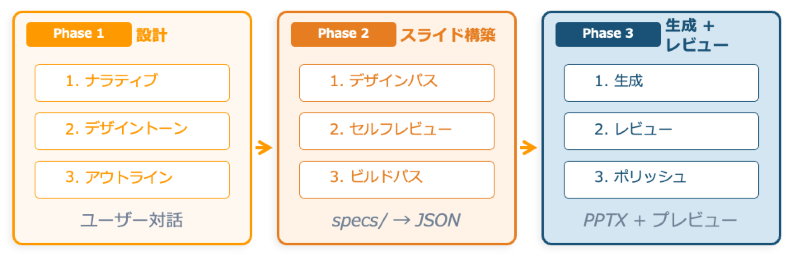

[EN](README.md) | [JA](README_ja.md)

# Spec-Driven Presentation Maker

[](LICENSE)
[](https://github.com/aws-samples/sample-spec-driven-presentation-maker/actions/workflows/ci.yml)
[](https://aws.amazon.com/jp/blogs/news/spec-driven-presentation-maker-ja/)

仕様駆動開発のアプローチでプレゼンテーション資料を作成するオープンソースツールキット。
「何を伝えるか」を先に設計し、「どう見せるか」を AI が構築します。

> 📝 コンセプトと背景は AWS ブログ [Spec-Driven Presentation Maker — 伝えたいことを先に設計し、スライド構築は AI に任せる](https://aws.amazon.com/jp/blogs/news/spec-driven-presentation-maker-ja/) もあわせてご覧ください。

<!-- TODO: デモ GIF/動画を撮影後に差し替え -->
<!--  -->

---

## 仕様駆動プレゼンテーションとは

従来の資料作成は「スライドを開いて、考えながら埋める」アプローチです。
構成が定まらないまま見た目の調整に時間を取られ、伝えたいメッセージがぼやけがちです。

仕様駆動プレゼンテーションは、ソフトウェア開発の仕様駆動開発（Spec-Driven Development）を資料作成に応用します。

| | 従来の資料作成 | 仕様駆動プレゼンテーション |
|---|---|---|
| 起点 | 白紙のスライド | ソース資料・要件 |
| 設計 | 作りながら考える | 先に論理構造を設計書として定義 |
| 構築 | 手作業でレイアウト | AI がテンプレートに準拠して自動構築 |
| 品質 | 属人的 | 設計書に基づくレビュー可能なプロセス |

### ワークフロー



### 頼めること

新規デッキの作成以外にも、やりたいことを伝えるだけでエージェントが対応するワークフローに
自動でルーティングされます:

| 頼み方 | 動作 |
|---|---|
| 「〜のスライドを作って」 | 新規プレゼン作成（ブリーフ → アートディレクション → アウトライン → 並列スライド作成 → レビュー） |
| 「この PPTX を編集して」 | 既存 PPTX を編集可能なデッキとして取り込み |
| 「PowerPoint で手直ししたので続きを」 | 手編集の内容をデッキに同期 |
| 「〜みたいなスタイルを作って」 | 再利用可能なスタイルガイドを作成（配色・タイポグラフィ・装飾） |
| 「このデッキを英語に翻訳して」 | 元デッキはそのままに、言語違いの派生デッキを作成 |

---

## クイックスタート

1 コマンドで `~/.sdpm` にすべてが入ります — AI エージェントが話す MCP サーバーと、
必要ならブラウザ用の Web UI。どちらも同じ checkout から動き、一緒に更新されます。
（唯一の例外は Claude Desktop で、こちらはダウンロードするバンドルを使います。下記参照。）

```bash
# macOS / Linux
curl -fsSL https://raw.githubusercontent.com/aws-samples/sample-spec-driven-presentation-maker/main/scripts/install/dist/install.sh | bash
```

```powershell
# Windows（PowerShell。CI での検証のみ）
irm https://raw.githubusercontent.com/aws-samples/sample-spec-driven-presentation-maker/main/scripts/install/dist/install.ps1 | iex
```

インストーラーが聞くのは 2 つだけ — ブラウザ用 Web UI も入れるか（Node.js が必要）と、
どの MCP クライアントに接続するか。最後に次にやることを表示します。その後は:

| やりたいこと | 手順 |
|---|---|
| いつもの AI エージェントで使う（Claude Code / Cursor / VS Code / Codex） | インストーラーの登録提案に yes と答えていれば、エージェントに**「〜のスライドを作って」**と頼むだけ。それ以外、または別のクライアントを後から: `sdpm register` |
| Kiro CLI で使う | インストーラーが専用の `sdpm` エージェントを作ります（ツールと信頼設定はそのエージェントに閉じ、他のセッションには何も足しません）: `kiro-cli chat --agent sdpm` |
| ブラウザで使う | `sdpm webui` |
| Claude Desktop で使う | [`sdpm.mcpb` をダウンロード](https://github.com/aws-samples/sample-spec-driven-presentation-maker/releases/latest/download/sdpm.mcpb)してダブルクリック（インストーラー不要） |
| チームで共有サーバー / Web UI を使う | [AWS にデプロイ](docs/en/deploy-cloudshell.md) |

`sdpm` だけで、何が入っていて何に接続済みかを表示します。`sdpm update` で両方の面を更新、
`sdpm uninstall` で全部削除。スライドのプレビュー（PNG）には LibreOffice と poppler が必要です —
インストーラーが導入を提案し、無くても PPTX は生成され、足りないものをエージェントに伝えます。
オプション、クライアントの手動設定、開発者向けセットアップは[はじめに](docs/ja/getting-started.md)へ。

### AI エージェントにインストールさせる

このリポジトリの URL をコーディングエージェントに渡して「入れて」と頼む人も多いはずです。
その場合（あなたでもエージェントでも）、非対話の形はこれです:

```bash
curl -fsSL https://raw.githubusercontent.com/aws-samples/sample-spec-driven-presentation-maker/main/scripts/install/dist/install.sh | bash -s -- --mcp-only --non-interactive --register
```

`--mcp-only` はブラウザ用 Web UI を省きます（含めるなら外すか `--full`。Node.js 20+ が必要）。
`--register` は見つかった全 MCP クライアントに確認なしで接続します（`--no-register` なら設定を
表示するだけ）。確認は `sdpm`（状態）と
`python3 ~/.sdpm/checkout/scripts/install/mcp_smoke.py ~/.local/bin/sdpm mcp`。全オプション:
[はじめに](docs/ja/getting-started.md#インストーラーのオプション)。

> **旧環境を移行するエージェントへの破壊的変更の注記:** インストーラー以前の導入手段 —
> Claude Code / Codex の plugin、Kiro Power、`make install-kiro`、`skills/` ディレクトリ、
> `uvx … sdpm-mcp` のクライアント設定 — はすべて廃止されました。
> [移行: 導入方法](docs/en/migration-onboarding.md)の表に従って削除してください。特に残りがちな
> `~/.kiro/agents/sdpm-composer.json` とグローバル `~/.kiro/settings/mcp.json` の項目は
> `sdpm register kiro-cli` が検出して削除を提案します。ツール名・prompt・デッキのファイルは変わりません。

**モードを選ぶ。** 頼むだけで十分ですが、明示したいときはサーバーの prompt を使います:
`sdpm-vibe`（素材から質問なしで作る）、`sdpm-spec`（対話で構成を固めてから作る）、
`sdpm-style`（再利用できるスタイルガイド）、`sdpm-translate`（デッキの言語版）— Claude Desktop の
「+」メニュー、Claude Code `/mcp__sdpm__sdpm-vibe`、VS Code `/mcp.sdpm.sdpm-vibe`、Kiro CLI
`/sdpm-vibe`。各 prompt は役割の入口ツールを指すだけで、振る舞いは `sdpm/references/workflows/`
の 1 か所にあります。

> **旧バージョンからのアップグレード:** 上の破壊的変更の注記と
> [移行: 導入方法](docs/en/migration-onboarding.md)を参照してください。それ以前の変更:
> [v0.5](docs/en/migration-v0.5.md)、[role workflows](docs/en/migration-role-workflows.md)。

---

## 🚀 AWS アカウントだけですぐに開始！ ワンクリックデプロイ

| リージョン | デプロイ |
|-----------|---------|
| 東京 (ap-northeast-1) | [](https://ap-northeast-1.console.aws.amazon.com/cloudformation/home#/stacks/create/review?stackName=SdpmDeploymentStack&templateURL=https://aws-ml-jp.s3.ap-northeast-1.amazonaws.com/asset-deployments/SdpmDeploymentStack.yaml) |
| バージニア北部 (us-east-1) | [](https://us-east-1.console.aws.amazon.com/cloudformation/home#/stacks/create/review?stackName=SdpmDeploymentStack&templateURL=https://aws-ml-jp.s3.ap-northeast-1.amazonaws.com/asset-deployments/SdpmDeploymentStack.yaml) |
| オレゴン (us-west-2) | [](https://us-west-2.console.aws.amazon.com/cloudformation/home#/stacks/create/review?stackName=SdpmDeploymentStack&templateURL=https://aws-ml-jp.s3.ap-northeast-1.amazonaws.com/asset-deployments/SdpmDeploymentStack.yaml) |

パラメータの詳細や別のデプロイ方法については [デプロイ手順](docs/en/deploy-cloudshell.md) を参照してください。

---

## ワークショップ

様々なシチュエーションでスライドを作成するためのサンプルデータを用意したハンズオンワークショップです。URL・PDF・CSV・議事録などからのスライド生成を実践できます。製造業、金融、ヘルスケア、IT など業界別シナリオも収録しています。

📖 **[ワークショップ](https://catalog.us-east-1.prod.workshops.aws/workshops/a275330a-0ae0-40b2-ad35-264e263c3882/ja-JP)**

---

## アーキテクチャ

```
sdpm/        エンジン（json <-> pptx）+ ナレッジ（references, assets, templates）
             references/workflows/ — 役割文書（orchestrator, composer, style,
             translate）。start_* 入口ツールで全 MCP クライアントに配信
servers/     local（stdio, AWS 不要）/ remote（HTTP, S3 + DynamoDB）— 単一ツールコントラクトの薄い bind
             local/client_config.py が MCP クライアントへの配線を担う（sdpm register）
scripts/install/   macOS / Linux / Windows のインストーラーと `sdpm` ランチャー。scripts/mcpb/ は Claude Desktop 用バンドル
agent/ api/ infra/ web-ui/   オプションの AWS クラウドスタック（Strands Agent, REST API, CDK, React UI）
```

エージェントに必要なもの — ツール・ワークフロー・ガイド・役割の振る舞い — はすべて
MCP サーバーが配信します。クライアント側には何も置きません。クライアントが持つのは
サーバーを起動する 1 行だけで、それは `sdpm register` が書き込みます。
全体像は [Architecture](docs/en/architecture.md) を参照してください。

---

## ドキュメント

詳細ドキュメントは英語版に一本化しています（日本語は README と「はじめに」のみ）。

| ドキュメント | 説明 |
|---|---|
| [はじめに（日本語）](docs/ja/getting-started.md) | 各環境のセットアップ手順 |
| [Getting Started](docs/en/getting-started.md) | Setup for every environment |
| [Architecture](docs/en/architecture.md) | レイヤー設計、データフロー、認証モデル、MCP ツール一覧 |
| [Migration to v0.5](docs/en/migration-v0.5.md) | v0.4 からの移行（パス変更、skills 廃止） |
| [Migration: role workflows](docs/en/migration-role-workflows.md) | v0.5 からの移行（ワークフロー統合、ツール/skill 名変更） |
| [Migration: onboarding](docs/en/migration-onboarding.md) | plugin / skill / `make install-kiro` / `uvx` からインストーラーへの移行 |
| [Recommended Deploy](docs/en/deploy-cloudshell.md) | CloudShell からの AWS デプロイ（CDK/Docker 不要） |
| [Connecting Agents](docs/en/add-to-gateway.md) | MCP クライアントの接続方法 |
| [Teams & Slack Integration](docs/en/teams-slack-integration.md) | チャットプラットフォーム連携 |
| [Custom Templates & Assets](docs/en/custom-template.md) | カスタムテンプレートとアセットの追加 |
| [Cost Estimates](docs/en/cost.md) | 月額コストの内訳と最適化 |
| [使用量の計測](docs/ja/usage-measurement.md) | PoC 運営者向けのユーザー別トークン・スライド数計測 |
| [Uninstall](docs/en/uninstall.md) | デプロイ済み AWS リソースの削除 |
| [Web UI（ローカルモード）](web-ui/README_ja.md#local-mode) | `sdpm webui` が Kiro CLI ACP をバックエンドにローカルで Web UI を動かす仕組み（AWS 不要） |

---

## テスト

```bash
make all    # リント + ユニットテスト
make test   # ユニットテストのみ
make lint   # ruff リントのみ
```

---

## Contributing

コントリビューションを歓迎します。詳細は [CONTRIBUTING.md](CONTRIBUTING.md) を参照してください。

## Code of Conduct

This project has adopted the [Amazon Open Source Code of Conduct](https://aws.github.io/code-of-conduct).

## Security

これはデモおよび教育目的のサンプルコードであり、本番環境での使用を想定していません。
デプロイ前に、組織のセキュリティ・規制・コンプライアンス要件を満たすよう、
セキュリティチームおよび法務チームと確認してください。

### 実装済みセキュリティ対策

- **S3 バケット**: パブリックアクセスブロック、サーバーサイド暗号化（SSE-S3）、バージョニング有効
- **DynamoDB**: 保存時暗号化、ポイントインタイムリカバリ有効
- **転送中データ**: すべての通信を TLS で暗号化
- **IAM**: サービスごとにスコープされた最小権限ロール、ワイルドカードリソース権限なし
- **API Gateway**: 全エンドポイントに Cognito JWT 認可
- **CloudFront**: Origin Access Identity（OAI）、HTTPS のみ、セキュリティヘッダー
- **シークレット**: ハードコードされた認証情報なし、環境変数または IAM ロール経由
- **AI/GenAI**: モデル出力は AI 生成として明示、データセットコンプライアンス文書化済み
- **ログ**: CloudWatch Logs（保持期間設定可能）、Bedrock 呼び出しログ（オプション）

### 環境依存の設定事項（デフォルトでは適用されません）

以下の項目は組織の環境、ネットワーク構成、セキュリティポリシーに依存するため、サンプルスタックとして安全にデフォルト適用できません。本番利用前に個別に評価してください。

1. **AWS CloudTrail** — アカウント単位の設定。既存の CloudTrail 設定への影響を避けるため個別に有効化
2. **S3・DynamoDB の VPC エンドポイント** — VPC 内にデプロイする場合のみ関連（このスタックは VPC を使用しない）
3. **AWS WAF による IP 制限** — 組み込みサポート済み。IP 範囲は環境依存のため、`config.yaml` の `waf.allowedIpV4AddressRanges` / `waf.allowedIpV6AddressRanges` または `deploy.sh` の `--waf-ipv4` / `--waf-ipv6` で指定
4. **CORS の限定** — 提供ドメインに依存
5. **S3 アクセスログ** — 保管先バケットと保持期間は利用者の選択
6. **Cognito 高度なセキュリティ（MFA、漏洩認証情報検出）** — デモ利用の摩擦を減らすためデフォルト無効
7. **Bedrock モデル・リージョン選定** — データ主権要件がある場合はクロスリージョン推論プロファイルを避ける
8. **スナップショット安全な暗号ライブラリ** — AgentCore ランタイムを `platformVersion` V2 にする場合のみ関係します。本スタックは V2 にしません（CloudFormation と CDK がこのフィールドを設定できないため、本サンプルをデプロイすると V1 で動きます）。V2 は 1 つのスナップショットから全インスタンスを復元するため、スナップショット取得前にシードされたユーザ空間の乱数生成器がインスタンス間で共有されます。本スタックがカーネルから得ている値は影響を受けません（`uuid.uuid4()` と `secrets` は呼び出しごとに `getrandom(2)` を読み、SigV4 署名は HMAC ベースで決定的）。したがって影響は送信 TLS の裏側にある OpenSSL の DRBG に限られます。V2 を有効にする場合は、MCP ランタイムの OpenSSL をスナップショット安全なビルドに置き換えてください（Amazon Linux 2023 の `openssl-snapsafe-libs`。`openssl-libs` と競合するため `--allowerasing` が必要）。あるいは、それを同梱する AWS 提供のベースイメージを使ってください。

### 脆弱性の報告

潜在的な脆弱性を発見した場合は、GitHub の公開 Issue を作成せず、[CONTRIBUTING.md](CONTRIBUTING.md#security-issue-notifications) の手順に従って報告してください。

## License

This project is licensed under the [MIT-0 License](LICENSE).
