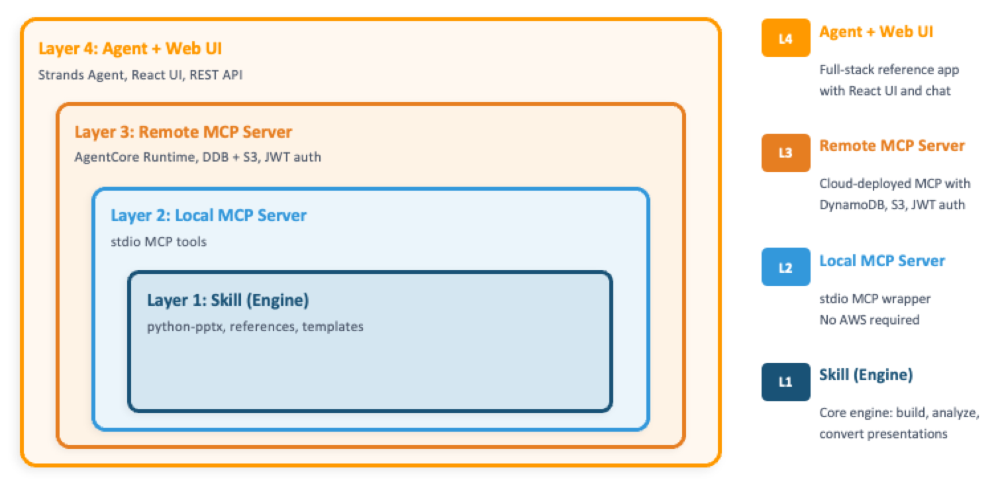
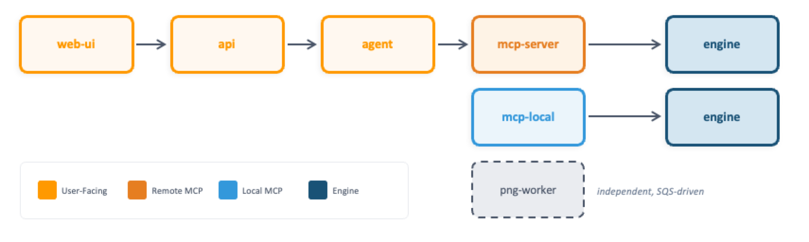
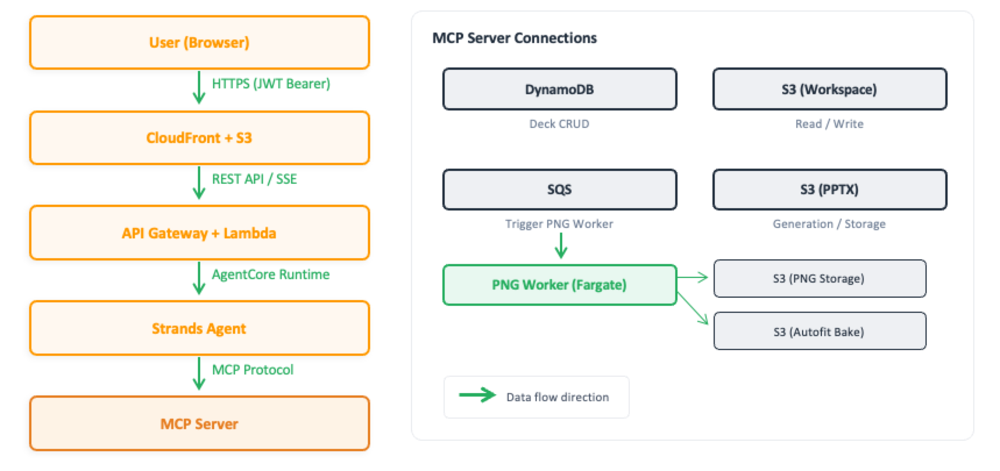
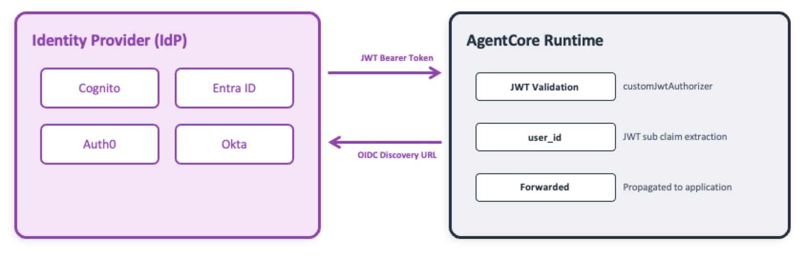
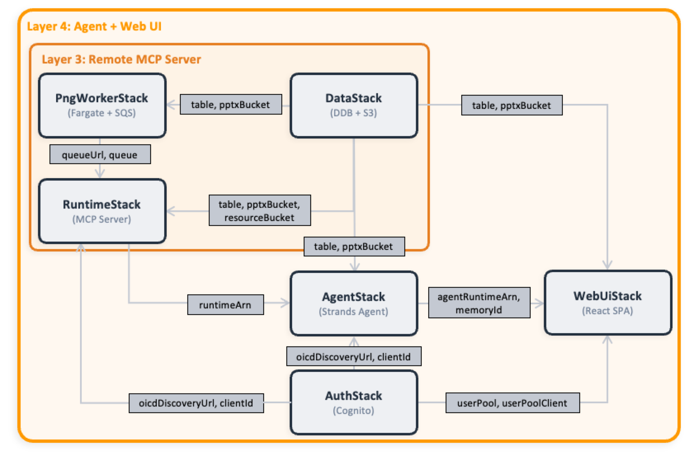

[EN](../en/architecture.md) | [JA](../ja/architecture.md)

# Architecture

This document describes spec-driven-presentation-maker's overall architecture, data flow, authentication and authorization model,
data model, CDK stack structure, and deployment patterns.

---

## 4-Layer Architecture

spec-driven-presentation-maker consists of 4 layers.
Each layer is a thin wrapper around the previous one — use only the layers you need.



### Dependency Direction

Dependencies always flow top-down.



---

## Layer 1: Skill (Engine)

The core presentation engine. No network, no AWS, no MCP — just Python.

- **sdpm/** — Builder, layout engine, analyzer, converter, asset resolver
- **references/** — Examples (slide patterns), workflows (phase instructions), guides (design rules)
- **templates/** — Sample .pptx templates (dark/light)
- **scripts/** — CLI entry point (`pptx_builder.py`), asset download scripts

Key capabilities:
- Analyze any .pptx template (layouts, colors, fonts, placeholders)
- Build slides from JSON with automatic layout optimization
- Generate PPTX files from `presentation.json`
- Convert existing PPTX back to JSON (`pptx_to_json`)
- Multi-source asset search (AWS icons, Material Symbols, custom)

---

## Layer 2: Local MCP Server

A thin MCP protocol wrapper around Layer 1. Runs as a stdio server.

- Exposes 17 tools via FastMCP
- **MCP Server Instructions** — The server returns workflow constraints; compatible MCP hosts inject them into the system prompt automatically. Agents follow the spec-driven process without additional configuration.
- No AWS required — all files stored locally

---

## Layer 3: Remote MCP Server

Layer 2 with storage swapped to Amazon DynamoDB + S3, plus authentication and authorization.

```
MCP Client → AgentCore Runtime → MCP Server Container
                                   ├── 20 MCP tools
                                   ├── LibreOffice (PPTX → PDF/SVG)
                                   ├── DynamoDB (decks, templates)
                                   ├── S3 (PPTX, previews, references, assets)
                                   └── Code Interpreter (optional)
```

Additional tools over Layer 2:
- `save_web_image` — Download a web image and save it to the deck workspace
- `read_uploaded_file` — Read content from a user-uploaded file (PDF, PPTX, text)
- `apply_style` — Apply a named style preset to a deck
- `run_python` — Execute Python in Amazon Bedrock AgentCore Code Interpreter sandbox (edit deck workspace, analyze data)
- `search_slides` — Semantic slide search via Amazon Bedrock Knowledge Base (optional)

### Storage

```
DynamoDB:
  USER#{userId}/DECK#{deckId}       — deck metadata
  TEMPLATE#{id}/META                — template metadata

S3 (pptx bucket):
  decks/{deckId}/deck.json          — deck metadata (template, fonts, defaultTextColor)
  decks/{deckId}/slides/{slug}.json — per-slide data
  decks/{deckId}/specs/             — brief.md, outline.md, art-direction.html
  decks/{deckId}/includes/          — code block JSON
  decks/{deckId}/compose/           — per-slide SVG compose JSON (for Web UI animation)
  previews/{deckId}/{slideId}.png   — slide previews

S3 (resource bucket):
  references/                       — examples, workflows, guides
  templates/                        — .pptx template files
  assets/                           — icons and images
```

### Deck Workspace

Using `run_python(deck_id=..., save=True)` loads the entire deck workspace into the sandbox.
The agent can read and write files using standard Python file I/O (`open`, `json.load`, etc.), and `save=True` writes changes back to S3.

```
deck.json           — deck metadata (template, fonts, defaultTextColor)
slides/{slug}.json  — per-slide data (one file per slide, slug from outline)
specs/brief.md          — briefing (audience, purpose, key messages)
specs/outline.md        — one line per slide: - [slug] message
specs/art-direction.html — visual design direction (HTML style guide)
includes/           — code block JSON files
```

### Authentication

- JWT Bearer authentication via Amazon Bedrock AgentCore Runtime's `customJwtAuthorizer`
- Default is Amazon Cognito User Pool; supports any OIDC-compliant IdP
- User identity: JWT `sub` claim propagated through the entire stack
- Authorization: role-based per deck (owner / collaborator / viewer)

### Preview Generation

The MCP Server container includes LibreOffice and poppler-utils for synchronous preview generation.
When `generate_pptx` is called, previews are generated inline:

```
generate_pptx:
  1. Build PPTX from deck workspace (deck.json + slides/*.json)
  2. LibreOffice: PPTX → PDF
  3. pdftoppm: PDF → per-page PNG
  4. Pillow: PNG → WebP (quality=85)
  5. Upload WebP previews to S3
  6. LibreOffice: PPTX → SVG (for compose + text measurement)
  7. SVG → per-slide compose JSON (for Web UI animation)
```

The agent uses `get_preview` to retrieve preview images and visually review slides.

The compose pipeline (step 6–7) extracts optimized SVG components per slide and uploads them as JSON to S3. The Web UI uses these to render animated slide transitions without re-fetching full preview images.

### Text Measurement

The `measure_slides` tool uses LibreOffice SVG export to measure text bounding boxes,
enabling overflow detection during the Build loop without visual review.

---

## Layer 4: Agent + Web UI

A reference implementation of a full-stack application.

- **Agent** — Strands Agent on Amazon Bedrock AgentCore Runtime, connects to Layer 3 MCP Server. Includes built-in tools: `web_fetch` (URL → Markdown, supports HTML/PDF/images) and `list_uploads` (list session uploads)
- **Web UI** — React + Tailwind CSS + shadcn/ui, deployed via S3 + Amazon CloudFront. Features animated slide preview via SVG compose pipeline
- **API** — Lambda-backed REST API (deck CRUD, file upload, chat history)
- **Auth** — Amazon Cognito User Pool with hosted UI

The agent's system prompt is minimal — workflow knowledge is dynamically retrieved from MCP Server Instructions, making the MCP Server the single source of truth.

---

## Data Flow

### Layer 4 (Full Stack) Data Flow




### Slide Generation Steps

1. User describes the presentation content via chat
2. Agent calls MCP Server tools to create a deck (`init_presentation`)
3. Analyzes the template and retrieves available layouts (`analyze_template`)
4. Following workflow files, designs briefing → outline → art direction (persisted to `specs/`)
5. Builds slides (`run_python` to edit files in the workspace)
6. Generates PPTX (`generate_pptx`) → saved to S3, previews generated synchronously
7. Retrieves preview images for review (`get_preview`)

---

## Authentication and Authorization Model

### JWT Bearer Authentication

spec-driven-presentation-maker integrates with any OIDC-compliant IdP (Identity Provider).



- Amazon Bedrock AgentCore Runtime's `customJwtAuthorizer` validates the JWT
- The JWT `sub` claim is propagated as `user_id` to the application
- By default, CDK creates an Amazon Cognito User Pool (for demo/quick start)
- For external IdPs, set `oidcDiscoveryUrl` and `allowedClients` in `config.yaml`

### Authorization (Role-Based Access Control)

Access is controlled per deck (presentation).

#### Role Resolution Priority

```
1. Is the user the deck creator?     → owner
2. Is there a sharing record?        → collaborator
3. Is the deck set to public?        → viewer
4. None of the above                 → none (access denied)
```

#### Permission Matrix

| Action | owner | collaborator | viewer | none |
|---|:---:|:---:|:---:|:---:|
| read (view deck info) | ✅ | ✅ | ✅ | — |
| preview (get preview images) | ✅ | ✅ | ✅ | — |
| edit_slide (edit slides) | ✅ | ✅ | — | — |
| generate_pptx (generate PPTX) | ✅ | ✅ | — | — |
| update (update deck info) | ✅ | — | — | — |
| delete_deck (delete deck) | ✅ | — | — | — |
| change_visibility (change public setting) | ✅ | — | — | — |

Authorization logic is centralized in `shared/authz.py`, used by both the API and MCP Server.
To add custom roles (e.g., team-based access), modify the `resolve_role` function.

---

## MCP Tool Reference

### Layer 2 Tools

| Category | Tool | Description |
|----------|------|-------------|
| Workflow | `init_presentation`, `analyze_template` | Initialize deck, analyze template |
| Generation | `generate_pptx`, `get_preview`, `measure_slides` | Generate PPTX, get preview, measure text bbox |
| Assets | `search_assets`, `list_asset_sources`, `list_templates` | Search icons, list sources, list templates |
| References | `list_styles`, `read_examples` | Slide style examples |
| References | `list_workflows`, `read_workflows` | Phase workflow instructions |
| References | `list_guides`, `read_guides` | Design rules and guides |
| Layout | `grid` | CSS Grid coordinate calculation |
| Utility | `code_to_slide`, `pptx_to_json` | Code highlighting, PPTX reverse conversion |

### Layer 3 Additional Tools

| Tool | Description |
|------|-------------|
| `save_web_image` | Download a web image and save it to the deck workspace |
| `read_uploaded_file` | Read content from a user-uploaded file (PDF, PPTX, text) |
| `apply_style` | Apply a named style preset to a deck |
| `run_python` | Execute Python in Code Interpreter sandbox |
| `search_slides` | Semantic slide search (optional, requires Amazon Bedrock KB) |

### Agent-Level Tools (Layer 4)

| Tool | Description |
|------|-------------|
| `web_fetch` | Fetch a URL and convert to Markdown (supports HTML, PDF, images) |
| `list_uploads` | List files uploaded in the current chat session |

---

## CDK Stack Structure

### Stack Dependencies



### Stack Roles

| Stack | Resources | config.yaml Key |
|---|---|---|
| SdpmData | Amazon DynamoDB table, S3 buckets ×2, reference deployment | `stacks.data` |
| SdpmRuntime | Amazon Bedrock AgentCore Runtime + ECR | `stacks.runtime` |
| SdpmAgent | Strands Agent (Amazon Bedrock AgentCore Runtime) | `stacks.agent` |
| SdpmWebUi | S3 + Amazon CloudFront + Amazon API Gateway + Lambda | `stacks.webUi` |
| SdpmAuth | Amazon Cognito User Pool (auto-created when agent or webUi enabled) | (auto) |

---

## Deployment Patterns

Select which stacks to enable in `config.yaml` for incremental deployment.

### Pattern 1: Layer 3 Only (MCP Server)

Minimum deployment. Connect directly from MCP clients.

### Pattern 2: Layer 3 + PNG Preview

Enables agents to visually review slides.

### Pattern 3: Full Stack (Layer 4)

Complete deployment including Web UI. Create slides via browser chat.

For `config.yaml` examples and deployment instructions, see [Getting Started — Layer 3](getting-started.md#layer-3-remote-mcp-server-aws).

---

## Related Documents

- [Getting Started](getting-started.md) — Setup and deployment instructions
- [Custom Templates](custom-template.md) — Adding templates and assets
- [Connecting Agents](add-to-gateway.md) — Amazon Bedrock AgentCore Gateway connection
