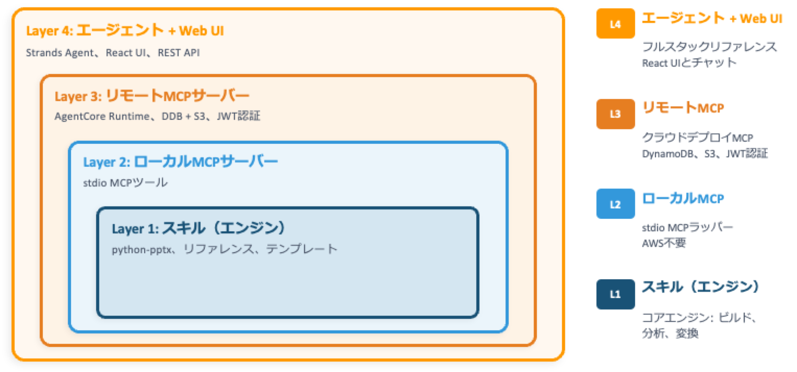
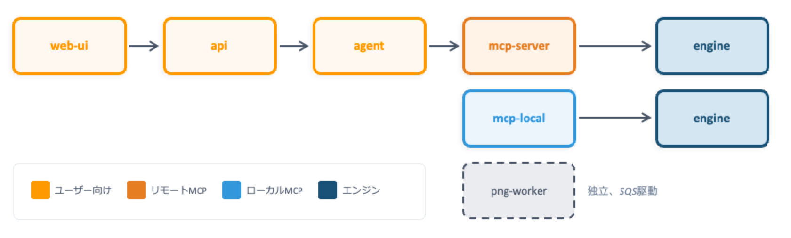
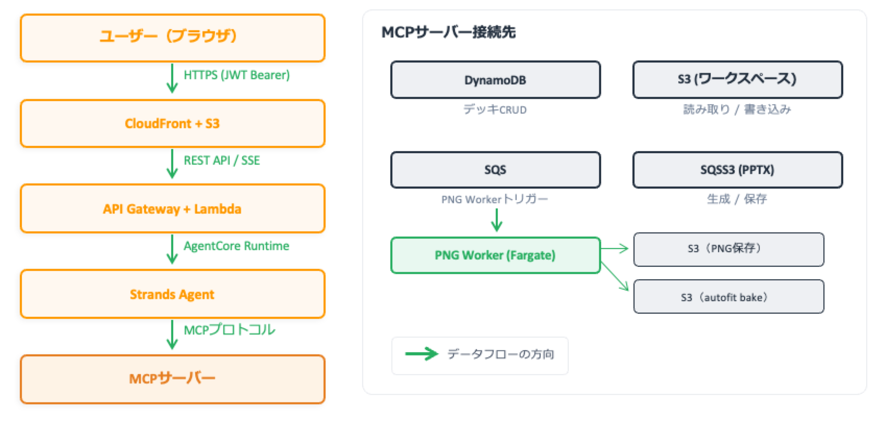
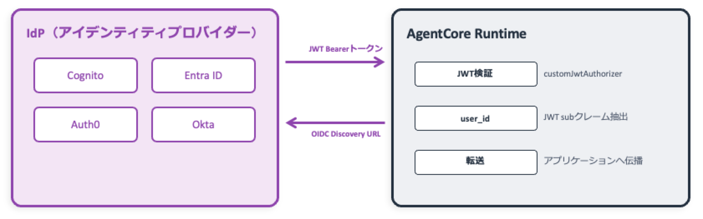

[EN](../en/architecture.md) | [JA](../ja/architecture.md)

# アーキテクチャ

本ドキュメントでは spec-driven-presentation-maker の全体アーキテクチャ、データフロー、認証・認可モデル、
データモデル、CDK スタック構成、およびデプロイパターンについて説明します。

---

## 4 層アーキテクチャ

spec-driven-presentation-maker は 4 つのレイヤーで構成されます。
各レイヤーは前のレイヤーの薄いラッパーであり、必要なレイヤーだけを選んで利用できます。



### レイヤー間の依存方向

依存は常に上から下への一方向です。



---

## Layer 1: Skill（Engine）

プレゼンテーション生成のコアエンジンです。ネットワーク不要、AWS 不要、MCP 不要 — Python だけで動作します。

- **sdpm/** — ビルダー、レイアウトエンジン、アナライザー、コンバーター、アセットリゾルバー
- **references/** — examples（スライドパターン）、workflows（フェーズ別手順）、guides（デザインルール）
- **templates/** — サンプル .pptx テンプレート（dark/light）
- **scripts/** — CLI エントリポイント（`pptx_builder.py`）、アセットダウンロードスクリプト

主な機能:
- 任意の .pptx テンプレートを自動解析（レイアウト、カラー、フォント、プレースホルダー）
- JSON からスライドを構築（自動レイアウト最適化付き）
- `presentation.json` から PPTX ファイルを生成
- 既存 PPTX を JSON に逆変換（`pptx_to_json`）
- マルチソースアセット検索（AWS アイコン、Material Symbols、カスタム）

---

## Layer 2: ローカル MCP サーバー

Layer 1 を MCP プロトコルでラップした薄いレイヤーです。stdio サーバーとして動作します。

- FastMCP 経由で 17 ツールを公開
- **MCP Server Instructions** — ワークフロー制約をサーバーが返し、対応する MCP ホストが system prompt に自動注入。エージェントは仕様駆動プロセスに自動的に従います
- AWS 不要 — すべてのファイルはローカルに保存

---

## Layer 3: リモート MCP サーバー

Layer 2 のストレージを Amazon DynamoDB + S3 に差し替え、認証・認可を追加した構成です。

```
MCP Client → AgentCore Runtime → MCP Server コンテナ
                                   ├── 20 MCP ツール
                                   ├── LibreOffice（PPTX → PDF/SVG）
                                   ├── DynamoDB（デッキ、テンプレート）
                                   ├── S3（PPTX、プレビュー、リファレンス、アセット）
                                   └── Code Interpreter（任意）
```

Layer 2 に対する追加ツール:
- `save_web_image` — Web 画像をダウンロードしてデッキワークスペースに保存
- `read_uploaded_file` — ユーザーがアップロードしたファイル（PDF、PPTX、テキスト）の内容を読み取り
- `apply_style` — 名前付きスタイルプリセットをデッキに適用
- `run_python` — Amazon Bedrock AgentCore Code Interpreter サンドボックスで Python を実行（デッキワークスペースの編集、データ分析）
- `search_slides` — Amazon Bedrock Knowledge Base によるセマンティックスライド検索（任意）

### ストレージ

```
DynamoDB:
  USER#{userId}/DECK#{deckId}       — デッキメタデータ
  TEMPLATE#{id}/META                — テンプレートメタデータ

S3（pptx バケット）:
  decks/{deckId}/deck.json          — デッキメタデータ（テンプレート、フォント、defaultTextColor）
  decks/{deckId}/slides/{slug}.json — スライドごとのデータ
  decks/{deckId}/specs/             — brief.md, outline.md, art-direction.html
  decks/{deckId}/includes/          — コードブロック JSON
  decks/{deckId}/compose/           — スライドごとの SVG compose JSON（Web UI アニメーション用）
  previews/{deckId}/{slideId}.png   — スライドプレビュー

S3（リソースバケット）:
  references/                       — examples, workflows, guides
  templates/                        — .pptx テンプレートファイル
  assets/                           — アイコン・画像
```

### デッキワークスペース

`run_python(deck_id=..., save=True)` を使うと、デッキワークスペース全体がサンドボックスにロードされます。
エージェントは通常の Python ファイル I/O（`open`, `json.load` 等）でファイルを読み書きでき、`save=True` で変更が S3 に書き戻されます。

```
deck.json           — デッキメタデータ（テンプレート、フォント、defaultTextColor）
slides/{slug}.json  — スライドごとのデータ（1 ファイル = 1 スライド、slug は outline から）
specs/brief.md          — ブリーフィング（対象者、目的、キーメッセージ）
specs/outline.md        — 1 行 1 スライド: - [slug] メッセージ
specs/art-direction.html — ビジュアルデザイン方針（HTML スタイルガイド）
includes/           — コードブロック JSON ファイル
```

### 認証

- Amazon Bedrock AgentCore Runtime の `customJwtAuthorizer` による JWT Bearer 認証
- デフォルトは Amazon Cognito User Pool、任意の OIDC 準拠 IdP に対応
- ユーザー識別: JWT `sub` クレームがスタック全体に伝播
- 認可: デッキ単位のロールベース（owner / collaborator / viewer）

### プレビュー生成

MCP Server コンテナには LibreOffice と poppler-utils が内蔵されており、プレビューを同期的に生成します。
`generate_pptx` 呼び出し時にインラインでプレビューが生成されます:

```
generate_pptx:
  1. デッキワークスペース（deck.json + slides/*.json）から PPTX をビルド
  2. LibreOffice: PPTX → PDF
  3. pdftoppm: PDF → スライドごとの PNG
  4. Pillow: PNG → WebP (quality=85)
  5. WebP プレビューを S3 にアップロード
  6. LibreOffice: PPTX → SVG（compose + テキスト計測用）
  7. SVG → スライドごとの compose JSON（Web UI アニメーション用）
```

エージェントは `get_preview` でプレビュー画像を取得し、スライドを視覚的にレビューします。

compose パイプライン（ステップ 6〜7）は、スライドごとに最適化された SVG コンポーネントを抽出し、JSON として S3 にアップロードします。Web UI はこれを使用して、フルプレビュー画像を再取得せずにアニメーション付きスライド遷移を描画します。

### テキスト計測

`measure_slides` ツールは LibreOffice の SVG エクスポートを使用してテキストのバウンディングボックスを計測し、
Build ループ中に視覚レビューなしでオーバーフローを検出できます。

---

## Layer 4: Agent + Web UI

フルスタックアプリケーションのリファレンス実装です。

- **Agent** — Strands Agent（Amazon Bedrock AgentCore Runtime 上）。Layer 3 MCP Server に接続。組み込みツール: `web_fetch`（URL → Markdown、HTML/PDF/画像対応）、`list_uploads`（セッション内アップロード一覧）
- **Web UI** — React + Tailwind CSS + shadcn/ui（S3 + Amazon CloudFront でデプロイ）。SVG compose パイプラインによるアニメーション付きスライドプレビュー
- **API** — Lambda ベースの REST API（デッキ CRUD、ファイルアップロード、チャット履歴）
- **Auth** — Amazon Cognito User Pool（ホスト UI 付き）

Agent の system prompt は最小限です — ワークフロー知識は MCP Server Instructions から動的に取得されるため、MCP Server が single source of truth になります。

---

## データフロー

### Layer 4（フルスタック）のデータフロー



### スライド生成の処理ステップ

1. ユーザーがチャットでプレゼンテーションの内容を指示
2. Agent が MCP Server のツールを呼び出し、デッキを作成（`init_presentation`）
3. テンプレートを分析し、利用可能なレイアウトを取得（`analyze_template`）
4. ワークフローファイルに従い、ブリーフィング → アウトライン → アートディレクションを設計（`specs/` に永続化）
5. スライドを構築（`run_python` でワークスペース内のファイルを編集）
6. PPTX を生成（`generate_pptx`）→ S3 に保存、プレビューを同期生成
7. プレビュー画像を取得してレビュー（`get_preview`）

---

## 認証・認可モデル

### JWT Bearer 認証

spec-driven-presentation-maker は OIDC 準拠の任意の IdP（Identity Provider）と連携できます。



- Amazon Bedrock AgentCore Runtime の `customJwtAuthorizer` が JWT を検証
- JWT の `sub` クレームが `user_id` としてアプリケーションに伝播
- デフォルトでは CDK が Amazon Cognito User Pool を作成（デモ・クイックスタート用）
- 外部 IdP を使う場合は `config.yaml` に `oidcDiscoveryUrl` と `allowedClients` を設定

### 認可（ロールベースアクセス制御）

デッキ（プレゼンテーション）単位でアクセスを制御します。

#### ロール解決の優先順位

```
1. デッキの作成者か？         → owner
2. 共有レコードがあるか？     → collaborator
3. デッキが公開設定か？       → viewer
4. いずれにも該当しない       → none（アクセス拒否）
```

#### パーミッションマトリクス

| アクション | owner | collaborator | viewer | none |
|---|:---:|:---:|:---:|:---:|
| read（デッキ情報の閲覧） | ✅ | ✅ | ✅ | — |
| preview（プレビュー画像の取得） | ✅ | ✅ | ✅ | — |
| edit_slide（スライドの編集） | ✅ | ✅ | — | — |
| generate_pptx（PPTX の生成） | ✅ | ✅ | — | — |
| update（デッキ情報の更新） | ✅ | — | — | — |
| delete_deck（デッキの削除） | ✅ | — | — | — |
| change_visibility（公開設定の変更） | ✅ | — | — | — |

認可ロジックは `shared/authz.py` に集約されており、API と MCP Server の両方が同じ関数を使用します。
カスタムロール（チームベースのアクセス等）を追加する場合は、`resolve_role` 関数を変更するだけで対応できます。

---

## MCP ツール一覧

### Layer 2 ツール

| カテゴリ | ツール | 説明 |
|---------|--------|------|
| ワークフロー | `init_presentation`, `analyze_template` | デッキ初期化、テンプレート解析 |
| 生成 | `generate_pptx`, `get_preview`, `measure_slides` | PPTX 生成、プレビュー取得、テキスト計測 |
| アセット | `search_assets`, `list_asset_sources`, `list_templates` | アイコン検索、ソース一覧、テンプレート一覧 |
| リファレンス | `list_styles`, `read_examples` | スライドスタイル例 |
| リファレンス | `list_workflows`, `read_workflows` | フェーズ別ワークフロー手順 |
| リファレンス | `list_guides`, `read_guides` | デザインルール・ガイド |
| レイアウト | `grid` | CSS Grid 座標計算 |
| ユーティリティ | `code_to_slide`, `pptx_to_json` | コードハイライト、PPTX 逆変換 |

### Layer 3 追加ツール

| ツール | 説明 |
|--------|------|
| `save_web_image` | Web 画像をダウンロードしてデッキワークスペースに保存 |
| `read_uploaded_file` | ユーザーがアップロードしたファイルの内容を読み取り |
| `apply_style` | 名前付きスタイルプリセットをデッキに適用 |
| `run_python` | Code Interpreter サンドボックスで Python 実行 |
| `search_slides` | セマンティックスライド検索（任意、Amazon Bedrock KB 必要） |

### Agent レベルツール（Layer 4）

| ツール | 説明 |
|--------|------|
| `web_fetch` | URL を取得して Markdown に変換（HTML、PDF、画像対応） |
| `list_uploads` | 現在のチャットセッションでアップロードされたファイル一覧 |

---

## CDK スタック構成

### スタック依存関係


### 各スタックの役割

| スタック | リソース | config.yaml キー |
|---|---|---|
| SdpmData | Amazon DynamoDB テーブル、S3 バケット ×2、リファレンスデプロイ | `stacks.data` |
| SdpmRuntime | Amazon Bedrock AgentCore Runtime + ECR | `stacks.runtime` |
| SdpmAgent | Strands Agent（Amazon Bedrock AgentCore Runtime） | `stacks.agent` |
| SdpmWebUi | S3 + Amazon CloudFront + Amazon API Gateway + Lambda | `stacks.webUi` |
| SdpmAuth | Amazon Cognito User Pool（agent または webUi 有効時に自動作成） | （自動） |

---

## デプロイ構成パターン

`config.yaml` で有効にするスタックを選択し、段階的にデプロイできます。

### パターン 1: Layer 3 のみ（MCP Server）

最小構成。MCP クライアントから直接接続して利用します。

### パターン 2: Layer 3 + PNG プレビュー

エージェントがスライドを視覚的にレビューできる構成。

### パターン 3: フルスタック（Layer 4）

Web UI を含む完全な構成。ブラウザからチャットでスライドを作成できます。

`config.yaml` の設定例とデプロイ手順は[はじめに — Layer 3](getting-started.md#layer-3-リモート-mcp-サーバーaws)を参照してください。

---

## 関連ドキュメント

- [はじめに](getting-started.md) — セットアップとデプロイ手順
- [カスタムテンプレート](custom-template.md) — テンプレートとアセットの追加
- [エージェント接続](add-to-gateway.md) — Amazon Bedrock AgentCore Gateway への接続方法
